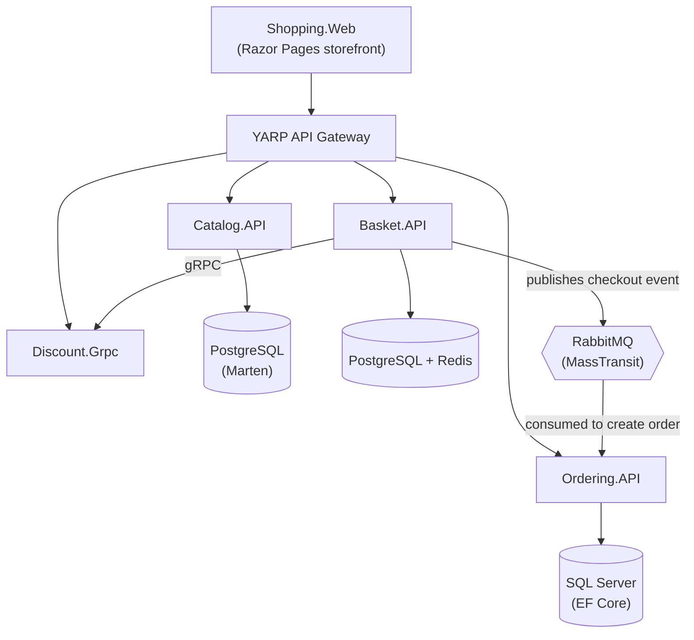

# eShop Microservices

A .NET 10 e-commerce reference application built with a microservices architecture, showcasing CQRS, Vertical Slice Architecture, Domain-Driven Design, and event-driven communication between services.

The system is composed of four independently deployable microservices sitting behind a YARP API Gateway, with a Razor Pages storefront consuming everything through the gateway. Every service owns its own database, and services stay decoupled by talking to each other over RabbitMQ (async) or gRPC (sync) instead of calling each other's APIs directly.

## Architecture



## Services

| Service | Responsibility | Persistence | Notes |
|---|---|---|---|
| **Catalog.API** | Product catalog (CRUD, browse by category) | PostgreSQL via Marten (document DB) | Vertical slice endpoints with Carter |
| **Basket.API** | Shopping cart (store, retrieve, delete, checkout) | PostgreSQL (Marten) + Redis cache | Calls Discount.Grpc synchronously to price items; publishes `BasketCheckoutEvent` to RabbitMQ on checkout |
| **Discount.Grpc** | Product discount lookup | SQLite via EF Core | Pure gRPC service, no REST surface |
| **Ordering.API** | Order placement and lifecycle | SQL Server via EF Core | Layered as Domain / Application / Infrastructure / API; consumes `BasketCheckoutEvent` from RabbitMQ to create orders |
| **YarpApiGateway** | Single entry point, reverse proxy to all APIs | – | Built on YARP |
| **Shopping.Web** | Customer-facing storefront | – | Razor Pages, talks to the gateway via Refit |

## Tech Stack

- **.NET 10 / ASP.NET Core** — all services target `net10.0`
- **CQRS** — MediatR-based command/query separation, implemented per service as vertical slices
- **Carter** — minimal API endpoint routing (Catalog, Basket, Ordering)
- **Marten** — PostgreSQL as a document database / event store (Catalog, Basket)
- **Entity Framework Core** — SQL Server (Ordering), SQLite (Discount)
- **MassTransit + RabbitMQ** — asynchronous event-driven communication between Basket and Ordering
- **gRPC** — synchronous service-to-service calls (Basket → Discount)
- **YARP** — reverse proxy API Gateway
- **Refit** — typed HTTP client in the web app
- **FluentValidation** — request validation via a MediatR pipeline behavior
- **Serilog** — structured logging, with a logging pipeline behavior around every MediatR request
- **Mapster** — object mapping
- **Scrutor** — assembly scanning / decoration for DI
- **Docker & Docker Compose** — full local orchestration of every service, database, cache, and broker

## Shared Building Blocks

Two shared libraries keep cross-cutting concerns consistent across services:

- **BuildingBlocks** — CQRS abstractions (base `ICommand`/`IQuery` types), MediatR pipeline behaviors (logging, validation), a global exception handling middleware, and a reusable pagination model.
- **BuildingBlocks.Messaging** — MassTransit/RabbitMQ setup and shared integration events.

## Design Patterns

- **CQRS** — commands and queries are modeled and handled separately in every service
- **Vertical Slice Architecture** — Catalog and Basket organize code by feature (e.g. `CreateProduct`, `GetProductsByCategory`) rather than by technical layer
- **Layered / Clean Architecture** — Ordering is split into Domain, Application, Infrastructure, and API projects
- **Database-per-service** — each service owns its own data store; no shared database
- **Event-driven communication** — Basket publishes a checkout event that Ordering consumes to create the order, keeping the two services decoupled
- **API Gateway** — the web app never talks to individual services directly

## Running Locally

The whole stack — Postgres, SQL Server, Redis, RabbitMQ, and all six services — is wired up in `docker-compose.yml` / `docker-compose.override.yml`.

```bash
cd src
docker compose up -d --build
```

Once containers are up:

| Service | URL |
|---|---|
| Shopping.Web | http://localhost:6005 |
| YARP Gateway | http://localhost:6004 |
| Catalog.API | http://localhost:6000 |
| Basket.API | http://localhost:6001 |
| Discount.Grpc | http://localhost:6002 |
| Ordering.API | http://localhost:6003 |
| RabbitMQ Management UI | http://localhost:15672 (guest/guest) |

## Project Structure

```
src/
├── ApiGateways/
│   └── YarpApiGateway/
├── building-blocks/
│   ├── BuildingBlocks/              # CQRS, behaviors, exceptions, pagination
│   └── BuildingBlocks.Messaging/    # MassTransit/RabbitMQ setup, events
├── services/
│   ├── catalog/Catalog.API/
│   ├── basket/Basket.API/
│   ├── discount/Discount.Grpc/
│   └── ordering/
│       ├── Ordering.API/
│       ├── Ordering.Application/
│       ├── Ordering.Domain/
│       └── Ordering.Infrastructure/
├── web-apps/
│   └── Shopping.Web/
└── docker-compose.yml
```

## Course & Certificate

This project was built while following [.NET Microservices: Architecture, Development, Deployment](https://www.udemy.com/course/microservices-architecture-and-implementation-on-dotnet) on Udemy.

- 🎓 Certificate: [View here](https://drive.google.com/file/d/1ncTyHQOOVLb-jpRR3FuWNttXllPE7C8j/view?usp=drive_link)

## Repository

🔗 [github.com/youssef-mohammed317/eshop-microservices](https://github.com/youssef-mohammed317/eshop-microservices)

## License

See [LICENSE](LICENSE).
